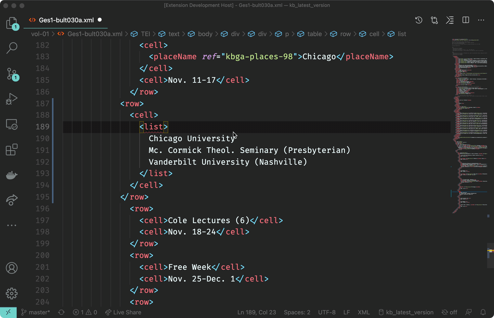

# TEI Publisher Extension for Visual Studio Code

An extension to help editors work on TEI and other XML documents. Only one of the features, namely preview, requires an instance of TEI Publisher. The rest is generally usable for XML editing.

## Features

* Some useful **commands** like
  * wrap selection with element
  * expand selection to parent node
  * split current element at cursor position
  * delete tag around current node
* **Preview** the currently edited TEI document by sending it to a TEI Publisher instance where it will be transformed to HTML via an existing ODD
* **Look up an entity** in one of the configured authority databases and replace the current selection with a TEI tag corresponding to the entity type

### Commands

Command | Shortcut | Mac | Other
---------|----------|---------|---------
Expand selection to parent element | ctrl-cmd-e | ctrl-alt-e
Wrap selection with element | cmd-e | ctrl-e
Split current element at cursor position | cmd-shift-d | ctrl-alt-d
Delete tag around current node | cmd-alt-x | ctrl+alt+x
Insert `<foreign>` | cmd-shift-f | ctrl-shift-f



### Preview

Get an HTML preview of the TEI file currently opened in the editor. The content is sent to a TEI Publisher endpoint and transformed to HTML via an ODD with processing instructions. The extension queries the server for a list of available ODDs and lets you choose one.

System | Keybinding
---------|----------
 mac | cmd-shift-a
 other | ctrl-shift-a


### Entity Markup

The extension installs a new view, _TEI Entity Explorer_, into the sidebar. To look up an entity, select some text within an XML document in the editor and press the configured keybinding. The selected string will be copied into the view's search input box and a search is triggered.

To apply one of the available entities to your XML, click on the + button to the left of it. Depending on the entity type, this will enclose the selected text into an appropriate TEI tag (persName, placeName, term ...).

System | Keybinding
---------|----------
 mac | cmd-shift-e
 other | ctrl-shift-e


## Configuration

### TEI Publisher instance

The _teipublisher.endpoint_ configuration property defines the HTTP or HTTPS URL the extension will communicate with to retrieve HTML previews. By default this points to a public TEI Publisher instance available on `https://teipublisher.com/exist/apps/tei-publisher`.

### API Connectors

The extension supports various authorities to query for entities:


Authority | Plugin name | Supported register types | Notes
---------|----------|---------|------------
Karl Barth-Gesamtausgabe, Basel | kbga | places, people, terms |
GND | gnd | places, people, organisations, terms |
Geonames | geonames | places | Requires a property "user"
Google Places | google | places | Requires an access token in property "token"
Metagrid (metagrid) | metagrid | people |

You can define a different connector for each entity type. The configuration is a JSON snippet like below:

```json
"teipublisher.apiList": [
    {
        "name": "places",
        "label": "Places",
        "plugin": "geonames",
        "template": "<placeName ref=\"${id}\">${0:$TM_SELECTED_TEXT}</placeName>",
        "user": "demo"
    },
    {
        "name": "people",
        "label": "People",
        "plugin": "gnd",
        "template": "<persName ref=\"${id}\">${0:$TM_SELECTED_TEXT}</persName>"
    },
    {
        "name": "terms",
        "label": "Terms",
        "plugin": "kbga",
        "template": "<term ref=\"${id}\">${0:$TM_SELECTED_TEXT}</term>"
    },
    {
        "name": "organisations",
        "label": "Organisations",
        "plugin": "kbga",
        "template": "<orgName ref=\"${id}\">${0:$TM_SELECTED_TEXT}</orgName>"
    }
]
```

The `name` property defines the name of the register to search in. It should correspond to one of the supported register types for each authority given in the table above.

The `label` property provides the text to be shown to the user in the dropdown.

`plugin` should correspond to one of the available plugin names given in the table above.

`template` defines the XML snippet to be inserted. It may reference the following variables returned by the API connector:

Variable | Description
---------|----------
 id | Unique ID returned by the API
 link | A link pointing to a description of the record
 label | The descriptive label for the item provided by the API 
 details | Further details on the item returned by the API

Within `template` you can also use vscode snippet parameters, e.g. `$0` to place the cursor at a certain position after inserting the text. `${0:$TM_SELECTED_TEXT}` will either insert the text selection or position the cursor if nothing is selected.

## Recommended Extensions

If you combine this with other extensions available on the vscode marketplace, you get rather decent XML editing support - not as sophisticated as with oXygen, but good enough for some serious work. 

For schema-based validation and context sensitive suggestions one can choose between two extensions: [Scholary XML](https://marketplace.visualstudio.com/items?itemName=raffazizzi.sxml) is lightweight and provides nice suggestions with documentation. It only understands relax-ng though and does not support catalogs, which means you need to reference the schema via a processing instruction in every TEI file. The second option, [XML Language Support by Red Hat](https://marketplace.visualstudio.com/items?itemName=redhat.vscode-xml), supports XML schema and catalogs, which you can use to associate the TEI namespace with a schema once and for all. Earlier versions required Java, but this is now optional and can be switched off (see config option `xml.server.preferBinary`).

To set up a catalog, just create a file `catalog.xml` somewhere with e.g. the following content and change the vscode configuration property `xml.catalogs` to point to it:

```xml
<catalog xmlns="urn:oasis:names:tc:entity:xmlns:xml:catalog">
  <uri
      name="http://www.tei-c.org/ns/1.0"
      uri="https://tei-c.org/Vault/P5/current/xml/tei/custom/schema/xsd/tei_all.xsd" />
</catalog>
```

Finally, if you use TEI Publisher as a basis for your own editions, you definitely want to install the [Language Server and Client for XQuery/eXistdb](https://marketplace.visualstudio.com/items?itemName=eXist-db.existdb-vscode). It supports working on XQuery files, syncing your local changes with the database, installing XAR files and more.