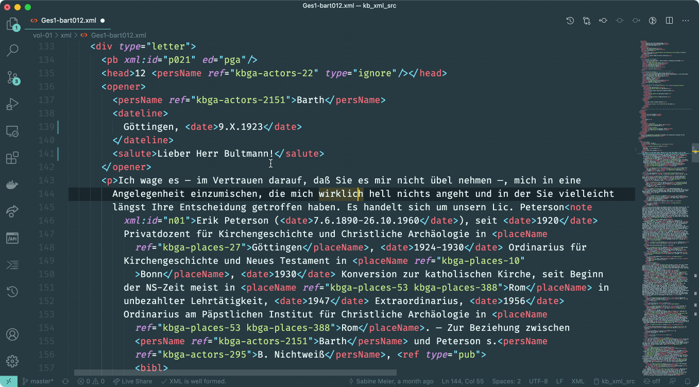

# TEI Publisher Extension for Visual Studio Code

An extension to help editors work on TEI files. 

## Features

* Preview the currently edited TEI document by sending it to a TEI Publisher instance where it will be transformed to HTML via an existing ODD
* Look up an entity in one of the configured authority databases and replace the current selection with a TEI tag corresponding to the entity type

### Preview

Get an HTML preview of the TEI file currently opened in the editor. The content is sent to a TEI Publisher endpoint and transformed to HTML via an ODD with processing instructions. The extension queries the server for a list of available ODDs and lets you choose one.

System | Keybinding
---------|----------
 mac | cmd-shift-a
 other | ctrl-shift-a


### Entity Markup

The extension installs a new view, _TEI Entity Explorer_, into the sidebar. To look up an entity, select some text within an XML document in the editor and press the configured keybinding. The selected string will be copied into the view's search input box and a search is triggered.

To apply one of the available entities to your XML, click on the + button to the left of it. Depending on the entity type, this will enclose the selected text into an appropriate TEI tag (persName, placeName, term ...).

System | Keybinding
---------|----------
 mac | cmd-shift-e
 other | ctrl-shift-e



 ### Snippets

Snippet | Shortcut (Mac/other)
---------|----------
 Insert `<foreign>` | cmd-shift-f / ctrl-shift-f

## Configuration

### TEI Publisher instance

The _teipublisher.endpoint_ configuration property defines the HTTP or HTTPS URL the extension will communicate with to retrieve HTML previews. By default this points to a public TEI Publisher instance available on `https://teipublisher.com/exist/apps/tei-publisher`.

### API Connectors

The extension supports various authorities to query for entities:


Authority | Plugin name | Supported register types | Notes
---------|----------|---------|------------
Karl Barth-Gesamtausgabe, Basel | kbga | places, people, terms |
GND | gnd | places, people, organisations, terms |
Google Places | google | places | Requires an access token
Metagrid (metagrid) | metagrid | people |

You can define a different connector for each entity type. The configuration is a JSON snippet like below:

```json
"teipublisher.apiList": [
    {
        "name": "places",
        "label": "Orte",
        "plugin": "google",
        "token": "my-private-token-registered-with-google"
    },
    {
        "name": "people",
        "label": "Akteure",
        "plugin": "gnd"
    },
    {
        "name": "terms",
        "label": "Sachen",
        "plugin": "kbga"
    }
]
```

The `name` property defines the name of the register to search in. It should correspond to one of the supported register types for each authority given in the table above.

The `label` property provides the text to be shown to the user in the dropdown.

`plugin` should correspond to one of the available plugin names given in the table above.

## Recommended Extensions

For proper XML editing support, we recommend installing either the [Scholary XML](https://marketplace.visualstudio.com/items?itemName=raffazizzi.sxml) or the [XML Language Support by Red Hat](https://marketplace.visualstudio.com/items?itemName=redhat.vscode-xml) extension. Scholary XML is more lightweight and has nice features, but it requires a `<?xml-model?>` processing instruction in every file. The Red Hat extension support catalog files, which allow you to associate an XML namespace with a certain schema. For example, a simple `catalog.xml` for all TEI files may look as follows:

```xml
<catalog xmlns="urn:oasis:names:tc:entity:xmlns:xml:catalog">
  <uri
      name="http://www.tei-c.org/ns/1.0"
      uri="https://tei-c.org/Vault/P5/current/xml/tei/custom/schema/xsd/tei_all.xsd" />
</catalog>
```

Store this somewhere and change the `xml.catalogs` setting in vscode to point to it.

Other extensions you might find useful:

* [Language Server and Client for XQuery/eXistdb](https://marketplace.visualstudio.com/items?itemName=eXist-db.existdb-vscode)
* [Auto Rename Tag](https://marketplace.visualstudio.com/items?itemName=formulahendry.auto-rename-tag)