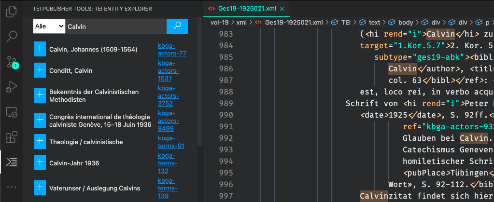

# TEI Publisher Extension for Visual Studio Code

A package to help editors work on TEI files.

## Features

* Preview the currently edited TEI document by sending it to a TEI Publisher instance where it will be transformed to HTML via an existing ODD
* Look up an entity in a register database
### Preview

Get an HTML preview of the TEI file currently opened in the editor. The content is sent to a TEI Publisher endpoint and transformed to HTML via an ODD with processing instructions. The extension queries the server for a list of available ODDs and lets you choose one.

System | Keybinding
---------|----------
 mac | cmd-shift-a
 other | ctrl-shift-a

### Entity Markup

The extension installs a new view, _TEI Entity Explorer_, into the sidebar. To look up an entity, select some text within an XML document in the editor and press the configured keybinding. The selected string will be copied into the view's search input box and a search is triggered.

To apply one of the available entities to your XML, click on the + button to the left of it. Depending on the entity type, this will enclose the selected text into an appropriate TEI tag (persName, placeName, term ...).

System | Keybinding
---------|----------
 mac | cmd-shift-e
 other | ctrl-shift-e



 ### Snippets

Snippet | Shortcut (Mac/other)
---------|----------
 Insert `<foreign>` | cmd-shift-f / ctrl-shift-f

## Configuration

### TEI Publisher instance

The _teipublisher.endpoint_ configuration property defines the HTTP or HTTPS URL the extension will communicate with to retrieve HTML previews. For example, to use your local TEI Publisher instance, set this to `http://localhost:8080/exist/apps/tei-publisher`.

### API Connectors

The extension supports various authorities to query for entities:

1. Karl Barth Archiv, Basel
2. Metagrid
3. Google Places

You can define a different connector for each entity type. The configuration is a JSON snippet like below:

```json
"teipublisher.apiList": [
    {
        "name": "places",
        "label": "Orte",
        "plugin": "google",
        "token": "my-private-token-registered-with-google"
    },
    {
        "name": "actors",
        "label": "Akteure",
        "plugin": "metagrid"
    },
    {
        "name": "terms",
        "label": "Sachen",
        "plugin": "kba"
    }
]
```